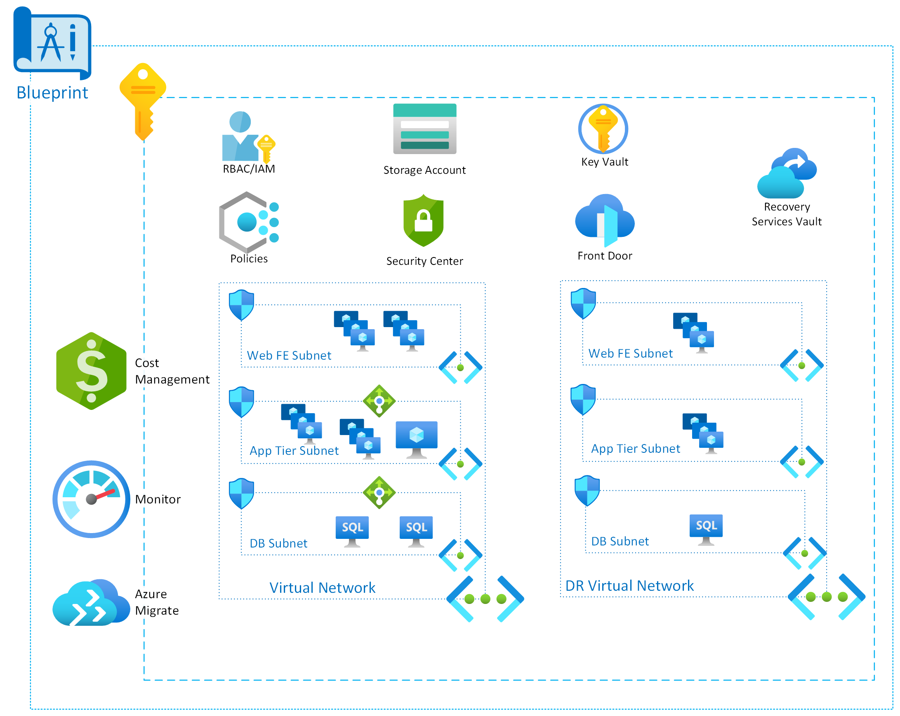
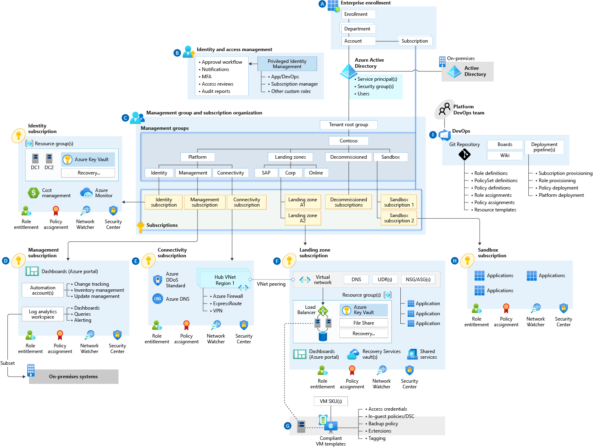

Landing Zones (Enterprise)

Whiteboard design session trainer guide

Nov 2020

Information in this document, including URL and other Internet Web site references, is subject to change without notice. Unless otherwise noted, the example companies, organizations, products, domain names, e-mail addresses, logos, people, places, and events depicted herein are fictitious, and no association with any real company, organization, product, domain name, e-mail address, logo, person, place or event is intended or should be inferred. Complying with all applicable copyright laws is the responsibility of the user. Without limiting the rights under copyright, no part of this document may be reproduced, stored in or introduced into a retrieval system, or transmitted in any form or by any means (electronic, mechanical, photocopying, recording, or otherwise), or for any purpose, without the express written permission of Microsoft Corporation.

Microsoft may have patents, patent applications, trademarks, copyrights, or other intellectual property rights covering subject matter in this document. Except as expressly provided in any written license agreement from Microsoft, the furnishing of this document does not give you any license to these patents, trademarks, copyrights, or other intellectual property.

The names of manufacturers, products, or URLs are provided for informational purposes only and Microsoft makes no representations and warranties, either expressed, implied, or statutory, regarding these manufacturers or the use of the products with any Microsoft technologies. The inclusion of a manufacturer or product does not imply endorsement of Microsoft of the manufacturer or product. Links may be provided to third party sites. Such sites are not under the control of Microsoft and Microsoft is not responsible for the contents of any linked site or any link contained in a linked site, or any changes or updates to such sites. Microsoft is not responsible for webcasting or any other form of transmission received from any linked site. Microsoft is providing these links to you only as a convenience, and the inclusion of any link does not imply endorsement of Microsoft of the site or the products contained therein.

© 2019 Microsoft Corporation. All rights reserved.

Microsoft and the trademarks listed at <https://www.microsoft.com/en-us/legal/intellectualproperty/Trademarks/Usage/General.aspx> are trademarks of the Microsoft group of companies. All other trademarks are property of their respective owners.

**Contents**

<!-- TOC -->

- [Trainer information](#trainer-information)
  - [Role of the trainer](#role-of-the-trainer)
  - [Whiteboard design session flow](#whiteboard-design-session-flow)
  - [Before the whiteboard design session: How to prepare](#before-the-whiteboard-design-session-how-to-prepare)
  - [During the whiteboard design session: Tips for an effective whiteboard design session](#during-the-whiteboard-design-session-tips-for-an-effective-whiteboard-design-session)
- [Landing Zones (Enterprise) whiteboard design session student guide](#landing-zones-enterprise-whiteboard-design-session-student-guide)
  - [Abstract and learning objectives](#abstract-and-learning-objectives)
  - [Step 1: Review the customer case study](#step-1-review-the-customer-case-study)
    - [Customer situation](#customer-situation)
    - [Customer needs](#customer-needs)
    - [Customer objections](#customer-objections)
    - [Infographic for common scenarios](#infographic-for-common-scenarios)
  - [Step 2: Design a proof of concept solution](#step-2-design-a-proof-of-concept-solution)
  - [Step 3: Present the solution](#step-3-present-the-solution)
  - [Wrap-up](#wrap-up)
  - [Additional references](#additional-references)
- [Landing Zones (Enterprise) whiteboard design session trainer guide](#landing-zones-enterprise-whiteboard-design-session-trainer-guide)
  - [Step 1: Review the customer case study](#step-1-review-the-customer-case-study-1)
  - [Step 2: Design a proof of concept solution](#step-2-design-a-proof-of-concept-solution-1)
  - [Step 3: Present the solution](#step-3-present-the-solution-1)
  - [Wrap-up](#wrap-up-1)
  - [Preferred target audience](#preferred-target-audience)
  - [Preferred solution](#preferred-solution)
  - [Checklist of preferred objection handling](#checklist-of-preferred-objection-handling)
  - [Customer quote (to be read back to the attendees at the end)](#customer-quote-to-be-read-back-to-the-attendees-at-the-end)

<!-- /TOC -->

# Trainer information

Thank you for taking time to support the whiteboard design sessions as a trainer!

## Role of the trainer

An amazing trainer:

-   Creates a safe environment in which learning can take place.

-   Stimulates the participant's thinking.

-   Involves the participant in the learning process.

-   Manages the learning process (on time, on topic, and adjusting to benefit participants).

-   Ensures individual participant accountability.

-   Ties it all together for the participant.

-   Provides insight and experience to the learning process.

-   Effectively leads the whiteboard design session discussion.

-   Monitors quality and appropriateness of participant deliverables.

-   Effectively leads the feedback process.

## Whiteboard design session flow 

Each whiteboard design session uses the following flow:

**Step 1: Review the customer case study (15 minutes)**

**Outcome**

Analyze your customer's needs.

-   Customer's background, situation, needs and technical requirements

-   Current customer infrastructure and architecture

-   Potential issues, objectives and blockers

**Step 2: Design a proof of concept solution (60 minutes)**

**Outcome**

Design a solution and prepare to present the solution to the target customer audience in a 15-minute chalk-talk format.

-   Determine your target customer audience.

-   Determine customer's business needs to address your solution.

-   Design and diagram your solution.

-   Prepare to present your solution.

**Step 3: Present the solution (30 minutes)**

**Outcome**

Present solution to your customer:

-   Present solution

-   Respond to customer objections

-   Receive feedback

**Wrap-up (15 minutes)**

-   Review preferred solution

## Before the whiteboard design session: How to prepare

Before conducting your first whiteboard design session:

-   Read the Student guide (including the case study) and Trainer guide.

-   Become familiar with all key points and activities.

-   Plan the point you want to stress, which questions you want to drive, transitions, and be ready to answer questions.

-   Prior to the whiteboard design session, discuss the case study to pick up more ideas.

-   Make notes for later.

## During the whiteboard design session: Tips for an effective whiteboard design session

**Refer to the Trainer guide** to stay on track and observe the timings.

**Do not expect to memorize every detail** of the whiteboard design session.

When participants are doing activities, you can **look ahead to refresh your memory**.

-   **Adjust activity and whiteboard design session pace** as needed to allow time for presenting, feedback, and sharing.

-   **Add examples, points, and stories** from your own experience. Think about stories you can share that help you make your points clearly and effectively.

-   **Consider creating a "parking lot"** to record issues or questions raised that are outside the scope of the whiteboard design session or can be answered later. Decide how you will address these issues, so you can acknowledge them without being derailed by them.

***Have fun**! Encourage participants to have fun and share!*

**Involve your participants.** Talk and share your knowledge but always involve your participants, even while you are the one speaking.

**Ask questions** and get them to share to fully involve your group in the learning process.

**Ask first**, whenever possible. Before launching into a topic, learn your audience's opinions about it and experiences with it. Asking first enables you to assess their level of knowledge and experience, and leaves them more open to what you are presenting.

**Wait for responses**. If you ask a question such as, "What's your experience with (fill in the blank)?" then wait. Do not be afraid of a little silence. If you leap into the silence, your participants will feel you are not serious about involving them and will become passive. Give participants a chance to think, and if no one answers, patiently ask again. You will usually get a response.

#  Landing Zones (Enterprise) whiteboard design session student guide

## Abstract and learning objectives 

In this whiteboard design session, you will look at how to design landing zones for Azure at an enterprise-scale. Your focus will be on a globally distributed enterprise scenario, where management is centralized but must systems must be distributed and administered globally for performance and geographical needs.

At the end of the workshop, you will be better able to design and use enterprise-scale design principals for landing zones with Azure, including enrollment, identity & access management, management group and subscription organization, network topology, management and monitoring, business continuity and disaster recovery, and security governance and compliance. You will also understand how to utilize Azure resources and best practices as well as better understand the challenges involved in managing Azure solutions at scale.

## Step 1: Review the customer case study 

**Outcome**

Analyze your customer's needs.

Timeframe: 15 minutes

Directions:  With all participants in the session, the facilitator/SME presents an overview of the customer case study along with technical tips.

1.  Meet your table participants and trainer.

2.  Read all of the directions for steps 1-3 in the student guide.

3.  As a table team, review the following customer case study.

### Customer situation

As head of Infrastructure Operations for Contoso Logistics, you are responsible for keeping all your in-house and customer applications & data, secure and available 100% of the time, as well as ensuring all of your security comply with all relevant standards and regulations. As your business grows, you need to scale your operations activities accordingly—but you must minimize costs and staffing needs.

Currently, your teams and equipment distributed through out multiple countries with minimal consistency of hardware types and versions due to rapid growth and minimal staff to deal with local equipment. As your company continues to grow, hardware is purchased as needed and multiple different calendars are needed to maintain various life cycles of the hardware. In addition, a large amount of your team's time is focused on monitoring and responding to physical and network reliability that is often out of their direct management (ie: ISP or unreliable data centers) rather than supporting the performance of the application or end users.

Your challenge is to redesign your operations for consistent, reliable communications regardless of their locality and move away from revolving hardware costs while allowing for dynamic growth for variety of solutions and applications. You need to create efficient processes that enable your team to repeat the same process for any environment and allow for centralized management and reporting around a single platform.

*Contoso Logistics data center and server locations*

### Customer needs 

1. **Management Access** Access to resources must be limited between different jurisdictions and managed through a central, agreed-upon authority. This must be monitored and have the ability to be reported on regularly for periodic audits.  This should also be a consistent structure for all environments.

2. **Backup and Disaster recovery** All data and virtual machines need to be backed up on a daily basis.  In addition, the critical systems must be to continue in the event of a disaster within 8 hours (RTO) with no more than a 2 hours of data loss (RPO). 

3. **Growth and Expansion** The design of the infrastructure must allow for growth of capacity to process increase in demand of resources as well as expand storage for data as historical information is retained for long term storage.

4. **Patch Management** All systems must have the ability to be patched and kept up to date with centralized reporting to security services for reporting and monitoring. 

5. **VM and Application Monitoring** The performance and availability of systems and applications must be monitored to ensure client experience is consistent. Also, trends and troubleshooting information should be available to support to help users and development group to improve features.

6. **Cost Management** As applications expand and grow, the costs to run those applications will often increase. The reporting of the applications should be able to tie back to the individual countries as well as applications.

7. **Consistent Design** The solutions proposed should provide a consistent and reliable design for all remote environments to minimize complexity and ease demands on the support team to ensure consistency of knowledge between areas..  The central environments should all mirror each other in design for disaster recovery purposes.

### Customer objections 

1. Reliability is a major concern as their business runs globally 24/7.  Service goals should look to achieve 99.95% SLA where possible.  In addition, the services should be optimized for performance regardless of where the user is in the world.

2. Cost is an ongoing concern for the enterprise. Solutions should not only be cost-efficient, but should be able to easily break down costs to individual regions for reports and parse application costs where possible.

3. Security and compliance are major concerns for the company. There are multiple different jurisdictional standards they must adhere to, but they must also ensure that their is standard baseline across all environments.

### Infographic for common scenarios

*Key pieces for Azure Blueprint*

*Core landing zone design*

*High level landing zone design*

## Step 2: Design a proof of concept solution

**Outcome**

Design a solution and prepare to present the solution to the target customer audience in a 15-minute chalk-talk format.

Timeframe: 60 minutes

**Business needs**

Directions: With all participants at your table, answer the following questions and list the answers on a flip chart:

1.  Who should you present this solution to? Who is your target customer audience? Who are the decision makers?

2.  What customer business needs do you need to address with your solution?

**Design**

Directions: With all participants at your table, respond to the following questions on a flip chart:

1. **Management Access** Design a solution to allow CL operation team with access to the divisional subscriptions.
   - The solution should support role-based access control to ensure consistent and reportable access across the environments
   - The solution should support user groups so as staff changes, access remains consistent and does not require redeployment
   - The solutions should also follow an inheritance structure where possible to allow for top-down distribution of rights

2. **Backup and Disaster recovery** All data and virtual machines need to be backed up regularly and critical systems continue in a disaster.
   - The solution must provide for the ability to backup and retain their data daily and have standard configurations for maintaining company standards
   - The solution must also ensure that critical systems continue to function in the event that there is a major disaster in a geographical area 
   - The solution must also ensure their critical systems are down for no more than 8 hours and loose no more than 2 hours worth of running data
   - The solution should also be able to be monitored and report if there are any issues or inconsistencies.
   - The solution should allow for reporting of systems that are not configured for protection

3. **Growth and Expansion** The design of the infrastructure must allow for growth of capacity of both compute and storage.
    - Virtual machines and applications should be able to grow or expand dynamically based on load
    - Storage of data should be available to retain legacy data for longer periods at a reduced rate
    - Storage of sensitive, or regulated data, should be kept within the local regions to ensure proper jurisdictional oversight
    - Structure of the data containers should be consistent across environments to allow for easier retrieval

4. **Patch Management** All systems must have the ability to be patched and kept up to date
   - Patch management must be maintained across all systems
   - Reports should be available centrally to allow for monitoring and compliance
   - Local administrators should be alerted to any systems not included in management

5. **VM and Application Monitoring** The performance and availability of systems and applications must be monitored to ensure client experience is consistent.
   - Local administrators should be alerted to any critical events and be able to respond appropriately
   - Reports of trends and status should be available to support to help users
   - Development group should be able to have access detailed logs only in the event of an escalation

6. **Cost Management** Reporting of costs should be made available to track and monitor expenses within the environment.
   - Reports must be available within each region and available to centralized management
   - Filtering of costs should be available by categorization of applications or other metadata
   - Certain data must be included on all resources relating to its purpose to allow for categorization

7. **Consistent Design** The solutions proposed should provide a consistent and reliable design for all remote environments.
   - There should be a standard, central designed that is repeated in each environment
   - The application is consistent around each environment, so the structure must be the same in each environment
   - Updates to the infrastructure should be possible without interruption and minimal affect to the existing environment
   - Rapid deployments for critical or security updates should be available from a central system across all environments

**Prepare**

Directions: With all participants at your table:

1.  Identify any customer needs that are not addressed with the proposed solution.

2.  Identify the benefits of your solution.

3.  Determine how you will respond to the customer's objections.

Prepare a 15-minute chalk-talk style presentation to the customer.

## Step 3: Present the solution

**Outcome**

Present a solution to the target customer audience in a 15-minute chalk-talk format.

Timeframe: 30 minutes

**Presentation**

Directions:

1.  Pair with another table.

2.  One table is the Microsoft team and the other table is the customer.

3.  The Microsoft team presents their proposed solution to the customer.

4.  The customer makes one of the objections from the list of objections.

5.  The Microsoft team responds to the objection.

6.  The customer team gives feedback to the Microsoft team.

7.  Tables switch roles and repeat Steps 2-6.

##  Wrap-up 

Timeframe: 15 minutes

Directions: Tables reconvene with the larger group to hear the facilitator/SME share the preferred solution for the case study.

##  Additional references

|    |            |
|----------|:-------------:|
| **Description** | **Links** |
|
| Microsoft Azure Reference Architectures | <https://docs.microsoft.com/azure/guidance/guidance-architecture> |
| Azure Landing Zones                        | <https://docs.microsoft.com/en-us/azure/cloud-adoption-framework/ready/landing-zone/>                    |
| Azure Cloud Adoption Framework (CAF)                   | <https://docs.microsoft.com/en-us/azure/cloud-adoption-framework/>                        |
| Tracking Costs (CAF) | <https://docs.microsoft.com/en-us/azure/cloud-adoption-framework/ready/azure-best-practices/track-costs> |
| Azure Automation | <https://docs.microsoft.com/en-us/azure/automation/update-management/manage-updates-for-vm> |
| Azure Migrate | <https://docs.microsoft.com/en-us/azure/migrate/concepts-migration-planning> |
| Azure Monitor | <https://docs.microsoft.com/en-us/azure/azure-monitor/overview> |
| Azure Policy | <https://docs.microsoft.com/en-us/azure/governance/policy/overview> |
|   |   |

# Landing Zones (Enterprise) whiteboard design session trainer guide

## Step 1: Review the customer case study

-   Check in with your table participants to introduce yourself as the trainer.

-   Ask, "What questions do you have about the customer case study?"

-   Briefly review the steps and timeframes of the whiteboard design session.

-   Ready, set, go! Let the table participants begin.

## Step 2: Design a proof of concept solution

-   Check in with your tables to ensure that they are transitioning from step to step on time.

-   Provide some feedback on their responses to the business needs and design.

    -   Try asking questions first that will lead the participants to discover the answers on their own.

-   Provide feedback for their responses to the customer's objections.

    -   Try asking questions first that will lead the participants to discover the answers on their own.

## Step 3: Present the solution

-   Determine which table will be paired with your table before Step 3 begins.

-   For the first round, assign one table as the presenting team and the other table as the customer.

-   Have the presenting team present their solution to the customer team.

    -   Have the customer team provide one objection for the presenting team to respond to.

    -   The presentation, objections, and feedback should take no longer than 15 minutes.

    -   If needed, the trainer may also provide feedback.

## Wrap-up

-   Have the table participants reconvene with the larger session group to hear the facilitator/SME share the following preferred solution.

##  Preferred target audience

* Leader - Hugo Fisher, Founder & CEO
* Finances - CFO
* Security - CSO
* Application Owners - Lead of Application Design
* Regional Heads

## Preferred solution

7. **Consistent Design** The solutions proposed should provide a consistent and reliable design for all remote environments.
   - There should be a standard, central designed that is repeated in each environment
   - The application is consistent around each environment, so the structure must be the same in each environment
   - Updates to the infrastructure should be possible without interruption and minimal affect to the existing environment
   - Rapid deployments for critical or security updates should be available from a central system across all environments

   *Solution*

   ***NOTE**: While this is an obviously important need of the client, solving this piece gives the client many of the other needs as well, so moving this to the top of the list*

   By utilizing [enterprise-scale landing zones](https://docs.microsoft.com/en-us/azure/cloud-adoption-framework/ready/enterprise-scale/) as part of the Cloud Adoption Framework (CAF), the client can utilize a standard blueprint in all regions and deployments to ensure a standard experience regardless of the location or subscription.

   Start with an example from the GitHub repository that ties back to a centralized network for a [Hub-Spoke](https://github.com/Azure/Enterprise-Scale/blob/main/docs/reference/adventureworks/README.md) or [VWan](https://github.com/Azure/Enterprise-Scale/blob/main/docs/reference/contoso/Readme.md) structure will allow communication of only those resources intended (such domain replication, no localized data, etc) and build on additional resources and data needed for the company's application. 

   The following sections will go over most of the design areas that should be focused on within the blueprint's design.

1. **Management Access** Design a solution to allow CL operation team with access to the divisional subscriptions.
   - The solution should support role-based access control to ensure consistent and reportable access across the environments
   - The solution should support user groups so as staff changes, access remains consistent and does not require redeployment
   - The solutions should also follow an inheritance structure where possible to allow for top-down distribution of rights

   *Solution*

   Existing users and groups can be synchronized with Azure AD via Azure AD Connect.  This can allow the same accounts and security in both locations to minimize management and ease use of users.

   Azure Resource Based Access Control (RBAC) provides the ability for limiting access to the environment.  Groups should be created in Azure AD around the roles of the users.  These groups should then be utilized to grant access by assigning **Roles** to Azure AD **Groups** using **Role assignments** to the Azure Subscription(s), Resource Groups, and Resources.  Access should only assigned to the groups and assignments should not be applied via individual users.  Users should then be added as members to the respective groups.

   Moreover, Management Groups can be utilized at the regional or national level to control access on member subscriptions based on reporting or compliance needs.  This ensures that multiple subscriptions within an area of reporting follow the same restrictions and guidelines

   For developers and third parties that temporarily need access, Azure AD B2B collaboration (also known as guest users) should be utilized to grant them access to the resources on a temporary basis.  These guest users should be applied to groups as above and permissions granted to those groups.  The manager should be specified as the person within the company responsible for the guest user for audit and tracking purposes. When the third party no longer needs access, the **Block sign in** should be set to **Yes** and the account removed if no longer expected in the future.

2. **Backup and Disaster recovery** All data and virtual machines need to be backed up regularly and critical systems continue in a disaster.
   - The solution must provide for the ability to backup and retain their data daily and have standard configurations for maintaining company standards
   - The solution must also ensure that critical systems continue to function in the event that there is a major disaster in a geographical area 
   - The solution must also ensure their critical systems are down for no more than 8 hours and loose no more than 2 hours worth of running data
   - The solution should also be able to be monitored and report if there are any issues or inconsistencies.
   - The solution should allow for reporting of systems that are not configured for protection

   *Solution*

   The virtual machines should utilize Azure Recovery Vault for Backup for their region.  Azure Policies in the blueprint can also be configured to ensure all production virtual machines are applied to a backup policy.  Each region can then specify the Backup policy for their regulatory needs and their systems will follow those standards.

   In addition, Azure Site Recovery within an Azure Recovery Vault should be setup for disaster recovery of critical systems.  The following systems need to be setup in the blueprint for production environments:
      - A second region to recovery resources in that is geographically separate from primary location
      - Virtual Network (VNet) with similar setup to production environment (including subnets, NSG, ASG, etc)
      - Recovery Plan setup to orchestrate failover (such as AD DS services, SQL Servers, then Web Servers)
      - Settings outside of the virtual machines such as public IP addresses, remote network connectivity, etc. in one of the following ways:
        - Via Recovery Plan either via Manual Steps (accounting for human & deployment time in RTO and instructions needed) or Automated Steps (accounting for development time, execution time (RTO), costs & complexity)
        - Via Pre-staged resources (costs considerations & automated steps needed should be considered such as Traffic Manager or Private routing via VPN tunnels to a Virtual Network Gateway)
   The following aspects can then be setup and performed within each region:
      - ASR deployed to systems identified as 'critical'

   Regular tests of each system should be done regularly:
      - Backups - every 2 - 6 months attempt to restore sets of critical files from backup to alternate server and verify consistency
      - ASR - Every 3 - 6 months perform Test Failover and run Quality Assurance (QA) tests against applications to ensure they work in DR scenario

3. **Growth and Expansion** The design of the infrastructure must allow for growth of capacity of both compute and storage.
    - Virtual machines and applications should be able to grow or expand dynamically based on load
    - Storage of data should be available to retain legacy data for longer periods at a reduced rate
    - Storage of sensitive, or regulated data, should be kept within the local regions to ensure proper jurisdictional oversight
    - Structure of the data containers should be consistent across environments to allow for easier retrieval

   *Solution*

   As the initial goal is to get virtual machines from teh hardware on premise into the cloud, the main focus here should be ensuring the Virtual Machines are sized appropriately utilizing the Azure Migration resources to account for current loads. It should then be advised to the client to Scale Up (increase size) the Virtual Machines to another size VM in off hours (as this requires a reboot of the VM) if the load is observed to be to high (either by user reports & troubleshooting or observed via logging [later])

   Virtual Machine Scale Sets could potentially be a solution for the applications of the client (Scale Out); however, it is not known that the application would work or function in such a scenario. Many applications keep stateful information on their local systems and thus could cause problems if the design relies on this solution. Due to time frame and unknowns, this is not a recommended solution but instead would be a follow step to prove validity in Azure then deploy to production.

   Storage for the database servers should mirror existing size of data use plus space for growth in two different ways:
    - Locally attached disks - growth should then be possible via attaching additional disks. This can either be done by: 
      - attaching additional and/or larger disks, but databases must be moved to the new disks
      - setup storage pools on local machine, add additional disks, and expanding volumes
    - SAN storage (additional costs and sometimes minimum levels)
      - Azure NetApp can provide storage via SMBv3 
      - Windows Storage Space VM or third party SAN VM (DR must be maintained for these VMs or their storage)

   Migration of applications to Azure PaaS solutions should be achieved by the following:
      - Setting up a Development subscription
      - Allow developers access to this subscription with limited types of resources via policy and monitored costs
      - Utilize AAD for application management and SQL PaaS
      - Copy data from production subscription to development subscription excluding PII and sensitive data
      - Develop and test solution
      - Once application confirmed and validated, deploy application to production subscription in new Resource Groups
      - Migrate data to Azure SQL PaaS via Data Migration tool
      - Redirect traffic utilizing Traffic Manager
      - Switch traffic to PaaS 
      - Backup VMs

4. **Patch Management** All systems must have the ability to be patched and kept up to date
   - Patch management must be maintained across all systems
   - Reports should be available centrally to allow for monitoring and compliance
   - Local administrators should be alerted to any systems not included in management

   *Solution*

   [Azure Automation](https://docs.microsoft.com/en-us/azure/automation/update-management/manage-updates-for-vm) allows for the approval and deployment of patches to Azure VMs.  By utilizing this tool, machines can be centrally managed and monitored via Azure as well assessing their compliance.

   Alternatively, a WSUS server could be deployed for a more typical management, but this requires a different management interface as well as an additional server.  There are nuanced locations this could be required, but it is likely not needed for this client.

   Azure PaaS resources for future deployments are kept patched and up to date by the Azure team and no tasks are needed by the client.

5. **VM and Application Monitoring** The performance and availability of systems and applications must be monitored to ensure client experience is consistent.
   - Local administrators should be alerted to any critical events and be able to respond appropriately
   - Reports of trends and status should be available to support to help users
   - Development group should be able to have access detailed logs only in the event of an escalation

   *Solution*

   Azure Monitor should be utilized to report on the status of virtual machines and PaaS resources in the future.  The 

   The design of the Alerts and Alert groups will need to be setup as part of the 

6. **Cost Management** Reporting of costs should be made available to track and monitor expenses within the environment.
   - Reports must be available within each region and available to centralized management
   - Filtering of costs should be available by categorization of applications or other metadata
   - Certain data must be included on all resources relating to its purpose to allow for categorization

   *Solution*

   The landing zone blueprint should include the tools need to [track costs](https://docs.microsoft.com/en-us/azure/cloud-adoption-framework/ready/azure-best-practices/track-costs) and provided visibility to finance teams, management teams, and/or apps teams.
   
   Furthermore, tagging policies for metadata can be setup and enforced via the landing zone blue print to ensure that application information is tagged on resources to allow for more detailed reporting via the costs center.

## Checklist of preferred objection handling

1. Reliability is a major concern as their business runs globally 24/7.  Service goals should look to achieve 99.95% SLA where possible.  In addition, the services should be optimized for performance regardless of where the user is in the world.

   *Response*

   The ability to run critical VMs, such as SQL or Application, with Availability Sets will allow the VMs to achieve 99.95% via Azure's SLA.  In addition, for added reliability, Azure Zones can allow for SLA's up to 99.99%, but they require some additional setup and not available in all regions. If this is selected, ensure a region that supports Availability Zones were used.

   For improved performance regardless of where the user is in the world, Front Door would provide a secure permitter solution with a Content Deliver Network (CDN) to allow for access geographically closer to the end user.

2. Cost is an ongoing concern for the enterprise. Solutions should not only be cost-efficient, but should be able to easily break down costs to individual regions for reports and parse application costs where possible.

 *Response*

   Cost reporting is always an important concern in almost all Azure clients' subscriptions.  Having cost center configured and alerting will provide the best reporting and active monitoring of costs.  Adding metadata with Tags to resources by standard and/or policy can help identify where costs are going.

   Using Azure Migration services to help properly identify resource needs ahead of time and allow for right sizing can provide the best option to ensure systems are not oversized. On going monitoring via Azure Monitor can also help identify systems that are over provisioned.

   In addition, developing a clear road map to get the application away from costly, generic compute costs like VM into optimized solutions with PaaS pieces can help take advantage of dynamic sizing and growth to get the best performance out of their dollars.

3. Security and compliance are major concerns for the company. There are multiple different jurisdictional standards they must adhere to, but they must also ensure that their is standard baseline across all environments.

   *Response*

   By utilizing RBAC for Azure resources, we can ensure that only those users with defined roles have only the intended access they need to the Azure environment.  Furthermore, by utilizing Azure AD, we can allow users to utilize their existing identities and better harden access with those accounts.
   
   In addition, we can bring in identities from partners on an as needed basis via Azure AD B2B with secure communications and defined access while minimizing exposure of our systems and management tasks.

   Finally, as the client moves to resources such as Azure SQL to extend RBAC structure and utilize features such as [Dynamic Data Masking](https://docs.microsoft.com/en-us/sql/relational-databases/security/dynamic-data-masking)

## Customer quote (to be read back to the attendees at the end)

From the details and designed help of Azure Landing Zones, we were able to quickly build our own blueprints to ensure reliable and consistent design across our entire enterprise.  In addition, we've are able to utilize the central reporting and management tools for tracking and watching our systems for now into the future as we continue to grow and scale our solutions.

\- Hugo Fisher, Founder of Contoso Logistics