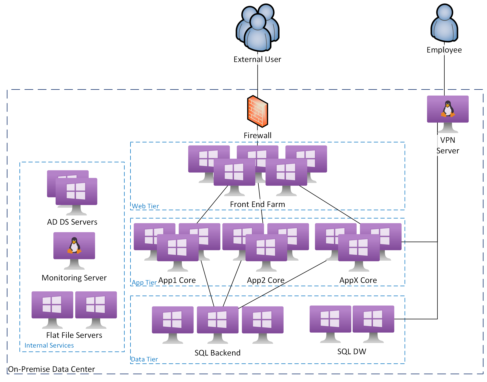
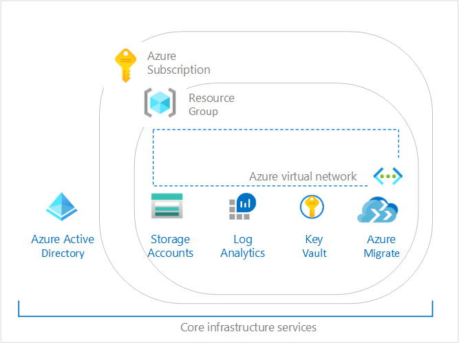
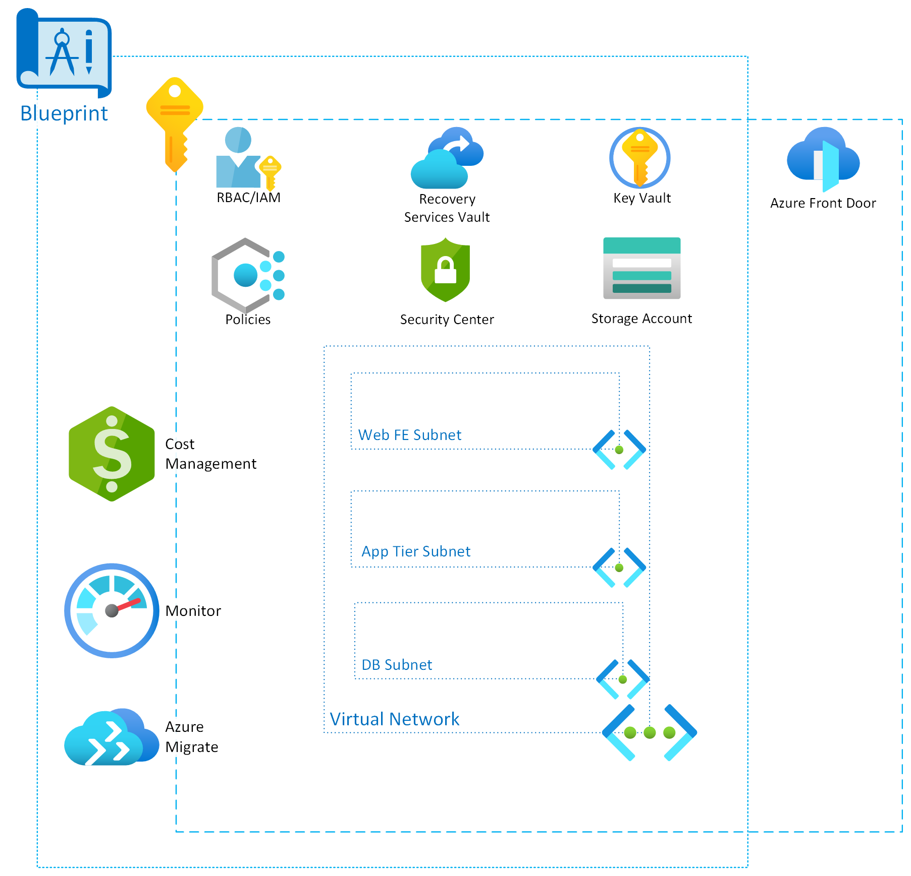

Designing an Azure Landing Zone (SMB)

Whiteboard design session trainer guide

November 2020

Information in this document, including URL and other Internet Web site references, is subject to change without notice. Unless otherwise noted, the example companies, organizations, products, domain names, e-mail addresses, logos, people, places, and events depicted herein are fictitious, and no association with any real company, organization, product, domain name, e-mail address, logo, person, place or event is intended or should be inferred. Complying with all applicable copyright laws is the responsibility of the user. Without limiting the rights under copyright, no part of this document may be reproduced, stored in or introduced into a retrieval system, or transmitted in any form or by any means (electronic, mechanical, photocopying, recording, or otherwise), or for any purpose, without the express written permission of Microsoft Corporation.

Microsoft may have patents, patent applications, trademarks, copyrights, or other intellectual property rights covering subject matter in this document. Except as expressly provided in any written license agreement from Microsoft, the furnishing of this document does not give you any license to these patents, trademarks, copyrights, or other intellectual property.

The names of manufacturers, products, or URLs are provided for informational purposes only and Microsoft makes no representations and warranties, either expressed, implied, or statutory, regarding these manufacturers or the use of the products with any Microsoft technologies. The inclusion of a manufacturer or product does not imply endorsement of Microsoft of the manufacturer or product. Links may be provided to third party sites. Such sites are not under the control of Microsoft and Microsoft is not responsible for the contents of any linked site or any link contained in a linked site, or any changes or updates to such sites. Microsoft is not responsible for webcasting or any other form of transmission received from any linked site. Microsoft is providing these links to you only as a convenience, and the inclusion of any link does not imply endorsement of Microsoft of the site or the products contained therein.

© 2020 Microsoft Corporation. All rights reserved.

Microsoft and the trademarks listed at <https://www.microsoft.com/en-us/legal/intellectualproperty/Trademarks/Usage/General.aspx> are trademarks of the Microsoft group of companies. All other trademarks are property of their respective owners.

**Contents**

<!-- TOC -->

- [Trainer information](#trainer-information)
    - [Role of the trainer](#role-of-the-trainer)
    - [Whiteboard design session flow](#whiteboard-design-session-flow)
    - [Before the whiteboard design session: How to prepare](#before-the-whiteboard-design-session-how-to-prepare)
    - [During the whiteboard design session: Tips for an effective whiteboard design session](#during-the-whiteboard-design-session-tips-for-an-effective-whiteboard-design-session)
- [Landing Zones Light whiteboard design session student guide](#landing-zones-light-whiteboard-design-session-student-guide)
    - [Abstract and learning objectives](#abstract-and-learning-objectives)
    - [Step 1: Review the customer case study](#step-1-review-the-customer-case-study)
        - [Customer background](#customer-background)
        - [Technical background](#technical-background)
        - [Customer situation](#customer-situation)
        - [Customer needs](#customer-needs)
        - [Customer objections](#customer-objections)
        - [Infographic for common scenarios](#infographic-for-common-scenarios)
    - [Step 2: Design a proof of concept solution](#step-2-design-a-proof-of-concept-solution)
    - [Step 3: Present the solution](#step-3-present-the-solution)
    - [Wrap-up](#wrap-up)
    - [Additional references](#additional-references)
- [Landing Zones Light whiteboard design session trainer guide](#landing-zones-light-whiteboard-design-session-trainer-guide)
    - [Step 1: Review the customer case study](#step-1-review-the-customer-case-study)
    - [Step 2: Design a proof of concept solution](#step-2-design-a-proof-of-concept-solution)
    - [Step 3: Present the solution](#step-3-present-the-solution)
    - [Wrap-up](#wrap-up)
    - [Preferred target audience](#preferred-target-audience)
    - [Preferred solution](#preferred-solution)
    - [Checklist of preferred objection handling](#checklist-of-preferred-objection-handling)
    - [Customer quote to be read back to the attendees at the end](#customer-quote-to-be-read-back-to-the-attendees-at-the-end)

<!-- /TOC -->

# Trainer information

Thank you for taking time to support the whiteboard design sessions as a trainer!

## Role of the trainer

An amazing trainer:

-   Creates a safe environment in which learning can take place.

-   Stimulates the participant's thinking.

-   Involves the participant in the learning process.

-   Manages the learning process (on time, on topic, and adjusting to benefit participants).

-   Ensures individual participant accountability.

-   Ties it all together for the participant.

-   Provides insight and experience to the learning process.

-   Effectively leads the whiteboard design session discussion.

-   Monitors quality and appropriateness of participant deliverables.

-   Effectively leads the feedback process.

## Whiteboard design session flow 

Each whiteboard design session uses the following flow:

**Step 1: Review the customer case study (15 minutes)**

**Outcome**

Analyze your customer's needs.

-   Customer's background, situation, needs and technical requirements

-   Current customer infrastructure and architecture

-   Potential issues, objectives and blockers

**Step 2: Design a proof of concept solution (60 minutes)**

**Outcome**

Design a solution and prepare to present the solution to the target customer audience in a 15-minute chalk-talk format.

-   Determine your target customer audience.

-   Determine customer's business needs to address your solution.

-   Design and diagram your solution.

-   Prepare to present your solution.

**Step 3: Present the solution (30 minutes)**

**Outcome**

Present solution to your customer:

-   Present solution

-   Respond to customer objections

-   Receive feedback

**Wrap-up (15 minutes)**

-   Review preferred solution

## Before the whiteboard design session: How to prepare

Before conducting your first whiteboard design session:

-   Read the Student guide (including the case study) and Trainer guide.

-   Become familiar with all key points and activities.

-   Plan the point you want to stress, which questions you want to drive, transitions, and be ready to answer questions.

-   Prior to the whiteboard design session, discuss the case study to pick up more ideas.

-   Make notes for later.

## During the whiteboard design session: Tips for an effective whiteboard design session

**Refer to the Trainer guide** to stay on track and observe the timings.

**Do not expect to memorize every detail** of the whiteboard design session.

When participants are doing activities, you can **look ahead to refresh your memory**.

-   **Adjust activity and whiteboard design session pace** as needed to allow time for presenting, feedback, and sharing.

-   **Add examples, points, and stories** from your own experience. Think about stories you can share that help you make your points clearly and effectively.

-   **Consider creating a "parking lot"** to record issues or questions raised that are outside the scope of the whiteboard design session or can be answered later. Decide how you will address these issues, so you can acknowledge them without being derailed by them.

***Have fun**! Encourage participants to have fun and share!*

**Involve your participants.** Talk and share your knowledge but always involve your participants, even while you are the one speaking.

**Ask questions** and get them to share to fully involve your group in the learning process.

**Ask first**, whenever possible. Before launching into a topic, learn your audience's opinions about it and experiences with it. Asking first enables you to assess their level of knowledge and experience, and leaves them more open to what you are presenting.

**Wait for responses**. If you ask a question such as, "What's your experience with (fill in the blank)?" then wait. Do not be afraid of a little silence. If you leap into the silence, your participants will feel you are not serious about involving them and will become passive. Give participants a chance to think, and if no one answers, patiently ask again. You will usually get a response.

#  Landing Zones (Light) whiteboard design session student guide

## Abstract and learning objectives 

In this whiteboard design session, you will look at how to design landing zones for Azure at a small deployment that can grow. Your focus will be on a small to medium size company scenario, where they are looking to move into a cloud and utilize features for future implementations.

At the end of the workshop, you will be better able to design and use core design principals for landing zones with Azure, including compute, networking, storage, data, role-based access, and hybrid cloud pieces. You will also understand how to utilize Azure resources and best practices as well as better understand the challenges involved in managing and growing Azure solutions.

## Step 1: Review the customer case study 

**Outcome**

Analyze your customer's needs.

Timeframe: 15 minutes

Directions:  With all participants in the session, the facilitator/SME presents an overview of the customer case study along with technical tips.

1.  Meet your table participants and trainer.

2.  Read all of the directions for steps 1-3 in the student guide.

3.  As a table team, review the following customer case study.

### Customer background

Contoso Excursions (CE) is a Microsoft client providing a personalized service for customers looking for vacation, business travel, and adventure packages.

Contoso was founded in Tampa in 2004, originally as Contoso Travel Services. The original business was started by former travel industry experts after the restructuring of the travel industry, providing high quality and optimized solutions for clientele. The personalized packaging services for affordable grouping saw welcomed growth and resurgence of people looking for good value and minimal details for international and unusual destinations with a personal touch and was expanded as an independent subsidiary as Contoso Travel Excursions.

The Founder and CEO of Contoso, Emma Fox, was quick to recognize that technology and online presence would be key for providing detailed, efficient, and personalized solutions for their customers from the beginning and built their solutions on the Microsoft stack. In 2018 she re-branded the company as Contoso Excursions and set in place a new business strategy offering cloud-based and hybrid cloud services. Given CE’s long history as a Microsoft client, Microsoft Azure was the natural choice as preferred public cloud provider.

CE has built a broad base of around key group of frequent travellers, as well as key international medium-sized businesses. More recently CE has also seen a growth via social media references and influencers, reflecting the company’s ongoing growth and success around personalized services.

### Technical background

The current CE application environment:
-   Legacy on-premises applications hosted in CE's datacenters with a remote co-location facility for disaster recovery. The hardware in these datacenters are aging and due for lease returns at the end of the year. The strategy is to migrate these solutions to cloud-based infrastructure before the hardware's end of life and then migrate to platform services to take advantage of scaling and features, and eventually minimizing all virtual solutions.
-   CE employees are based throughout the world and access the daily application and reports via a VPN connection to the primary data center.
-   CE customers access details via an IIS web server farm with a firewall
-   Infrastructure consists of 50 Hyper-V based production virtual machines as well as 4 physical servers consisting of two SQL clusters running SQL 2016 that run their core business applications and a data warehouse for reporting
-   The data warehouse is fully refreshed weekly with exports from the production database

*Contoso Excursions On-Premise Design*

CE has an Enterprise Agreement with Microsoft for their applications and would like to utilize as much of their existing agreement benefits as possible.

### Customer situation

As Director of Information Technology for Contoso Excursions, you are responsible for keeping all your in-house and customer applications & services healthy, secure and available 100% of the time. As your business grows, you need to scale your operations activities accordingly—but you can only use the resources your already have.

Currently, your team manages all technology equipment and customer connectivity--so as the number of customers grows, so does your workload.  Your hardware is already frequently maintaining 80% utilization during business hours and clients report sporadic timeouts at peak times.  The budgeted plan was only expected to refresh the hardware at the end of the year when the current lease ends.

Your challenge is to migrate your solution to the cloud to ensure reliable, dynamic growth and shrink depending on user demand. However, the estimated time frame to update the application is beyond the time for the pending hardware refresh. You need to create a reliable plan to migrate your infrastructure to the cloud while providing a development environment for the application refresh moves forward and execute the plan with minimal client interruption.

*Contoso Excursions On-Premise Design*

### Customer needs 

1. **Follow Best Practices** The solution chosen for this deployment should follow well-known best practices and be repeatable for future needs. Also, utilizing pre-built solutions should be utilized to ensure deployment in the tight time frame. Furthermore, it should be easy to understand for future staff brought on through growth or augmentation.

2. **Management Access** Access to resources must be limited to only the staff that is required and at the least privilege required. There should be options for third parties to have limited access to only those resources they need for support or development.

3. **Backup and Disaster recovery** All data and virtual machines need to be backed up on a daily basis.  In addition, the critical systems must be to continue in the event of a disaster within 12 hours (RTO) with no more than a 4 hours of data loss (RPO). 

4. **Growth and Expansion** The design of the infrastructure must allow for growth of capacity to process increase in demand of resources as well as expand storage for data as historical information is retained for long term storage. In addition, the design must allow for the transition of applications for IaaS to PaaS as they become available.

5. **Patch Management** All systems must have the ability to be patched and kept up to date with centralized reporting to security services for reporting and monitoring. 

6. **VM and Application Monitoring** The performance and availability of systems and applications must be monitored to ensure client experience is consistent. Also, trends and troubleshooting information should be available to support to help users and development group to improve features.

7. **Cost Management** As applications expand and grow, the costs to run those applications will often increase. The reporting of the costs should be able to tie back to the individual applications.

8. **Minimize Downtime** The migrations to the cloud should allow for minimum downtime to the applications as they transition between environments. More over, the solution should encompass enough redundancy to allow for planned patching, updating, and deployment without downtime.

### Customer objections 

1. Reliability is a concern as their business support people throughout the world. Service goals should look to achieve 99.95% SLA where possible.  In addition, the final application services should be optimized for performance regardless of where the user is in the world.

2. Cost is an ongoing concern for the enterprise. Solutions should not only be cost-efficient, but should be able to easily break down costs to individual regions for reports and parse application costs where possible. In addition, the final solution should be able to scale up and down depending on the current demand.

3. Security is a major concerns for the company. Users' personal identity information (PII) must be kept confidential and secure from both people outside the organization, as well as personnel within the company that do not need access for their work.

### Infographic for common scenarios

## Step 2: Design a proof of concept solution

**Outcome**

Design a solution and prepare to present the solution to the target customer audience in a 15-minute chalk-talk format.

Timeframe: 60 minutes

**Business needs**

Directions: With all participants at your table, answer the following questions and list the answers on a flip chart:

1.  Who should you present this solution to? Who is your target customer audience? Who are the decision makers?

2.  What customer business needs do you need to address with your solution?

**Design**

Directions: With all participants at your table, respond to the following questions on a flip chart:

**High-Level architecture**

Create a high-level architecture diagram and explanation of the components of your solution.

1. **Follow Best Practices** The structure and deployment should follow best practices and published knowledge from experts.
   - The core design should be well documented and easily understood for future deployments and staff added at a later time.
   - The solution should be repeatable for deployments in new regions or for development purposes

2. **Management Access** Access to resources must be limited to only the staff that is required
   - Staff should only be granted the least amount of access that is needed to do their job
   - Third parties should be able to utilize their own identities securely with only the access they need into the client's environment

3. **Backup and Disaster recovery** All data and virtual machines need to be backed up on a daily basis. 
   - Data should be retrievable in the event of corruption or deletion daily going back a month
   - Monthly versions should be kept for a year
   - A copy of financial and audit data should be kept each year and maintained for 7 years
   - Critical systems must continue in the event of a disaster within 12 hours
   - In the event of a disaster, no more than a 4 hours of critical should be lost. 

4. **Growth and Expansion** The design of the infrastructure must allow for growth of capacity
   - The design should allow for systems to increase in power as load increases with the growth of business
   - Storage design should allow for data growth as more data comes into the system with business growth
   - The design should allow for the migration of applications to a PaaS system for dynamic growth both up and down in the future

5. **Patch Management** All systems must have the ability to be patched and kept up to date
   - Reports should be available for centralized monitoring. 
   - The design should also provide for the ability to alert on systems not kept up to date in production environments

6. **VM and Application Monitoring** The performance and availability of systems and applications must be monitored to ensure client experience is consistent.
   - Reports of trends and status for troubleshooting should be available to support to help users
   - Development group should have be able to have access to logs when they are troubleshooting problems or planning for future growth

7. **Cost Management** As applications expand and grow, the costs to run those applications will often increase. 
   - The reporting of the costs should be able to tie back to the individual applications
   - Metadata should be associated with resources to identify their purpose or application

8. **Minimize Downtime** As resources are migrated to the cloud,  minimum downtime should be targeted for critical applications.
   - The solution should encompass enough redundancy to allow for the following planned events without downtime:
     - patching
     - updates 
     - deployment

**Prepare**

Directions: With all participants at your table:

1.  Identify any customer needs that are not addressed with the proposed solution.

2.  Identify the benefits of your solution.

3.  Determine how you will respond to the customer's objections.

Prepare a 15-minute chalk-talk style presentation to the customer.

## Step 3: Present the solution

**Outcome**

Present a solution to the target customer audience in a 15-minute chalk-talk format.

Timeframe: 30 minutes

**Presentation**

Directions:

1.  Pair with another table.

2.  One table is the Microsoft team and the other table is the customer.

3.  The Microsoft team presents their proposed solution to the customer.

4.  The customer makes one of the objections from the list of objections.

5.  The Microsoft team responds to the objection.

6.  The customer team gives feedback to the Microsoft team.

7.  Tables switch roles and repeat Steps 2-6.

##  Wrap-up 

Timeframe: 15 minutes

Directions: Tables reconvene with the larger group to hear the facilitator/SME share the preferred solution for the case study.

##  Additional references

|                                         |                                                                   |
|-----------------------------------------|:-----------------------------------------------------------------:|
| **Description**                         | **Links**                                                         |
| Microsoft Azure Reference Architectures | <https://docs.microsoft.com/azure/guidance/guidance-architecture> |
| Azure Landing Zones                        | <https://docs.microsoft.com/en-us/azure/cloud-adoption-framework/ready/landing-zone/>                    |
| Azure Cloud Adoption Framework (CAF)                   | <https://docs.microsoft.com/en-us/azure/cloud-adoption-framework/>                        |
| Azure Migrate | <https://docs.microsoft.com/en-us/azure/migrate/concepts-migration-planning> |
| Azure Monitor | <https://docs.microsoft.com/en-us/azure/azure-monitor/overview> |
| Azure Policy | <https://docs.microsoft.com/en-us/azure/governance/policy/overview> |
|   |   |

# Landing Zones (Light) whiteboard design session trainer guide

## Step 1: Review the customer case study

-   Check in with your table participants to introduce yourself as the trainer.

-   Ask, "What questions do you have about the customer case study?"

-   Briefly review the steps and timeframes of the whiteboard design session.

-   Ready, set, go! Let the table participants begin.

## Step 2: Design a proof of concept solution

-   Check in with your tables to ensure that they are transitioning from step to step on time.

-   Provide some feedback on their responses to the business needs and design.

    -   Try asking questions first that will lead the participants to discover the answers on their own.

-   Provide feedback for their responses to the customer's objections.

    -   Try asking questions first that will lead the participants to discover the answers on their own.

## Step 3: Present the solution

-   Determine which table will be paired with your table before Step 3 begins.

-   For the first round, assign one table as the presenting team and the other table as the customer.

-   Have the presenting team present their solution to the customer team.

    -   Have the customer team provide one objection for the presenting team to respond to.

    -   The presentation, objections, and feedback should take no longer than 15 minutes.

    -   If needed, the trainer may also provide feedback.

## Wrap-up

-   Have the table participants reconvene with the larger session group to hear the facilitator/SME share the following preferred solution.

##  Preferred target audience

* Leader - Emma Fox, Founder & CEO
* Finances - CFO
* Application(s) Owner - Lead of Application Design
* Security - Information Security Manager

## Preferred solution

1. **Follow Best Practices** The structure and deployment should follow best practices and published knowledge from experts.
   - The core design should be well documented and easily understood for future deployments and staff added at a later time.
   - The solution should be repeatable for deployments in new regions or for development purposes

   *Solution*

   Azure landing zones are part of a multi-subscription Azure environment that accounts for scale, security, governance, networking, and identity. Azure landing zones enable application migrations and greenfield development at an enterprise scale in Azure.

   No single solution fits all technical environments. By utilizing the [migration landing zone](https://docs.microsoft.com/en-us/azure/cloud-adoption-framework/ready/landing-zone/migrate-landing-zone) blueprint the client can start with a well known, good design that encompasses resources such as:
   - Migration tools
   - Logging and monitoring
   - Network
   - Identity
   - Policy
   - Single production subscription
   - Resource groups
   - Management groups
   - Data storage
   - Naming and tagging standards
   - Cost management
   - Compute options

   This will provide the tools and structure to migrate resources from the existing on premise environment into a well designed cloud structure.

2. **Management Access** Access to resources must be limited to only the staff that is required
   - Staff should only be granted the least amount of access that is needed to do their job
   - Third parties should be able to utilize their own identities securely with only the access they need into the client's environment

   *Solution*

   Existing users and groups can be synchronized with Azure AD via Azure AD Connect.  This can allow the same accounts and security in both locations to minimize management and ease use of users.

   Azure Resource Based Access Control (RBAC) provides the ability for limiting access to the environment.  Groups should be created in Azure AD around the roles of the users.  These groups should then be utilized to grant access by assigning **Roles** to Azure AD **Groups** using **Role assignments** to the Azure Subscription(s), Resource Groups, and Resources.  Access should only assigned to the groups and assignments should not be applied via individual users.  Users should then be added as members to the respective groups.

   For developers and third parties that temporarily need access, Azure AD B2B collaboration (also known as guest users) should be utilized to grant them access to the resources on a temporary basis.  These guest users should be applied to groups as above and permissions granted to those groups.  The manager should be specified as the person within the company responsible for the guest user for audit and tracking purposes. When the third party no longer needs access, the **Block sign in** should be set to **Yes** and the account removed if no longer expected in the future.

2. **Backup and Disaster recovery** All data and virtual machines need to be backed up on a daily basis. 
    - Data should be retrievable in the event of corruption or deletion daily going back a month
    - Monthly versions should be kept for a year
    - A copy of financial and audit data should be kept each year and maintained for 7 years
    - Critical systems must continue in the event of a disaster within 12 hours
    - In the event of a disaster, no more than a 4 hours of critical should be lost. 

   *Solution*

   The virtual machines should utilize Azure Recovery Vault for Backup to a remote region on a daily basis.  There should be two policies created:
      - **Default Policy** - dailies kept for a month, and monthlies kept for 1 year
      - **Financial System Policy** - dailies kept for a month, and monthlies kept for 1 year, yearly kept for 7 years

   In addition, Azure Site Recovery within an Azure Recovery Vault should be setup for disaster recovery of critical systems.  The following systems need to be setup:
      - A second region to recovery resources in that is geographically separate from primary location (ie: Central US)
      - Virtual Network (VNet) with similar setup to production environment (including subnets, NSG, ASG, etc)
      - ASR deployed to systems identified as 'critical'
      - Recovery Plan setup to orchestrate failover (such as AD DS services, SQL Servers, then Web Servers)
      - Settings outside of the virtual machines such as public IP addresses, remote network connectivity, etc. in one of the following ways:
        - Via Recovery Plan either via Manual Steps (accounting for human & deployment time in RTO and instructions needed) or Automated Steps (accounting for development time, execution time (RTO), costs & complexity)
        - Via Pre-staged resources (costs considerations & automated steps needed should be considered such as Traffic Manager or Private routing via VPN tunnels to a Virtual Network Gateway)

   Regular tests of each system should be done regularly:
      - Backups - every 2 - 6 months attempt to restore sets of critical files from backup to alternate server and verify consistency
      - ASR - Every 3 - 6 months perform Test Failover and run Quality Assurance (QA) tests against applications to ensure they work in DR scenario

3. **Growth and Expansion** The design of the infrastructure must allow for growth of capacity
   - The design should allow for systems to increase in power as load increases with the growth of business
   - Storage design should allow for data growth as more data comes into the system with business growth
   - The design should allow for the migration of applications to a PaaS system for dynamic growth both up and down in the future

   *Solution*

   As the initial goal is to get virtual machines from teh hardware on premise into the cloud, the main focus here should be ensuring the Virtual Machines are sized appropriately utilizing the Azure Migration resources to account for current loads. It should then be advised to the client to Scale Up (increase size) the Virtual Machines to another size VM in off hours (as this requires a reboot of the VM) if the load is observed to be to high (either by user reports & troubleshooting or observed via logging [later])

   Virtual Machine Scale Sets could potentially be a solution for the applications of the client (Scale Out); however, it is not known that the application would work or function in such a scenario. Many applications keep stateful information on their local systems and thus could cause problems if the design relies on this solution. Due to time frame and unknowns, this is not a recommended solution but instead would be a follow step to prove validity in Azure then deploy to production.

   Storage for the database servers should mirror existing size of data use plus space for growth in two different ways:
    - Locally attached disks - growth should then be possible via attaching additional disks. This can either be done by: 
      - attaching additional and/or larger disks, but databases must be moved to the new disks
      - setup storage pools on local machine, add additional disks, and expanding volumes
    - SAN storage (additional costs and sometimes minimum levels)
      - Azure NetApp can provide storage via SMBv3 
      - Windows Storage Space VM or third party SAN VM (DR must be maintained for these VMs or their storage)

   Migration of applications to Azure PaaS solutions should be achieved by the following:
      - Setting up a Development subscription
      - Allow developers access to this subscription with limited types of resources via policy and monitored costs
      - Utilize AAD for application management and SQL PaaS
      - Copy data from production subscription to development subscription excluding PII and sensitive data
      - Develop and test solution
      - Once application confirmed and validated, deploy application to production subscription in new Resource Groups
      - Migrate data to Azure SQL PaaS via Data Migration tool
      - Redirect traffic utilizing Traffic Manager
      - Switch traffic to PaaS 
      - Backup VMs

4. **Patch Management** All systems must have the ability to be patched and kept up to date
   - Reports should be available for centralized monitoring. 
   - The design should also provide for the ability to alert on systems not kept up to date in production environments

   *Solution*

   [Azure Automation](https://docs.microsoft.com/en-us/azure/automation/update-management/manage-updates-for-vm) allows for the approval and deployment of patches to Azure VMs.  By utilizing this tool, machines can be centrally managed and monitored via Azure as well assessing their compliance.

   Alternatively, a WSUS server could be deployed for a more typical management, but this requires a different management interface as well as an additional server.  There are nuanced locations this could be required, but it is likely not needed for this client.

   Azure PaaS resources for future deployments are kept patched and up to date by the Azure team and no tasks are needed by the client.

5. **VM and Application Monitoring** The performance and availability of systems and applications must be monitored to ensure client experience is consistent.
   - Reports of trends and status for troubleshooting should be available to support to help users
   - Development group should have be able to have access to logs when they are troubleshooting problems or planning for future growth

   *Solution*

   Azure Monitor should be utilized to report on the status of virtual machines and PaaS resources in the future.  The 

   The design of the Alerts and Alert groups will need to be setup as part of the 

6. **Cost Management** As applications expand and grow, the costs to run those applications will often increase. 
   - The reporting of the costs should be able to tie back to the individual applications
   - Metadata should be associated with resources to identify their purpose or application

   *Solution*

   The landing zone blueprint will include the tools need to [track costs](https://docs.microsoft.com/en-us/azure/cloud-adoption-framework/ready/azure-best-practices/track-costs) and provided visibility to finance teams, management teams, and/or apps teams.
   
   Furthermore, tagging policies for metadata can be setup and enforced via the landing zone blue print to ensure that application information is tagged on resources to allow for more detailed reporting via the costs center.

7. **Minimize Downtime** As resources are migrated to the cloud,  minimum downtime should be targeted for critical applications.
   - The solution should encompass enough redundancy to allow for the following planned events without downtime:
     - patching
     - updates 
     - deployment

   *Solution*

   Azure Migration included as part of the landing page blueprint can allow for proper analyzing of on premise resources, replication of infrastructure and data to Azure, and minimize cutover time frames by allowing for ongoing replication changes with only a small delta need on the execution day.

   Furthermore, systems that have redundant systems (like critical applications) can be deployed to either Application Sets or Application Zones to ensure at least 99.95% SLA availability.

*Contoso Excursions Preferred Solution*

## Checklist of preferred objection handling

1. Reliability is a concern as their business support people throughout the world. Service goals should look to achieve 99.95% SLA where possible.  In addition, the final application services should be optimized for performance regardless of where the user is in the world.

   *Response*

   The ability to run critical VMs, such as SQL or Application, with Availability Sets will allow the VMs to achieve 99.95% via Azure's SLA.  In addition, for added reliability, Azure Zones can allow for SLA's up to 99.99%, but they require some additional setup and not available in all regions. If this is selected, ensure a region that supports Availability Zones were used.

   For improved performance regardless of where the user is in the world, Front Door would provide a secure permitter solution with a Content Deliver Network (CDN) to allow for access geographically closer to the end user.

2. Cost is an ongoing concern for the enterprise. Solutions should not only be cost-efficient, but should be able to easily break down costs to individual regions for reports and parse application costs where possible. In addition, the final solution should be able to scale up and down depending on the current demand.

   *Response*

   Cost reporting is always an important concern in almost all Azure clients' subscriptions.  Having cost center configured and alerting will provide the best reporting and active monitoring of costs.  Adding metadata with Tags to resources by standard and/or policy can help identify where costs are going.

   Using Azure Migration services to help properly identify resource needs ahead of time and allow for right sizing can provide the best option to ensure systems are not oversized. On going monitoring via Azure Monitor can also help identify systems that are over provisioned.

   In addition, developing a clear road map to get the application away from costly, generic compute costs like VM into optimized solutions with PaaS pieces can help take advantage of dynamic sizing and growth to get the best performance out of their dollars.

3. Security is a major concerns for the company. Users' personal identity information (PII) must be kept confidential and secure from both people outside the organization, as well as personnel within the company that do not need access for their work.

   *Response*

   By utilizing RBAC for Azure resources, we can ensure that only those users with defined roles have only the intended access they need to the Azure environment.  Furthermore, by utilizing Azure AD, we can allow users to utilize their existing identities and better harden access with those accounts.
   
   In addition, we can bring in identities from partners on an as needed basis via Azure AD B2B with secure communications and defined access while minimizing exposure of our systems and management tasks.

   Finally, as the client moves to resources such as Azure SQL to extend RBAC structure and utilize features such as [Dynamic Data Masking](https://docs.microsoft.com/en-us/sql/relational-databases/security/dynamic-data-masking)

## Customer quote (to be read back to the attendees at the end)

With the provided best practices and well designed Azure Landing Zones, we were able to quickly bring our on premise solution to the cloud with reliability and assure continued service to our clients in a very short time frame allowing us to focus our resources on growing and expanding our solution for a dynamic and evolving technological world.

\- Emma Fox, Founder & CEO of Contoso Excursions